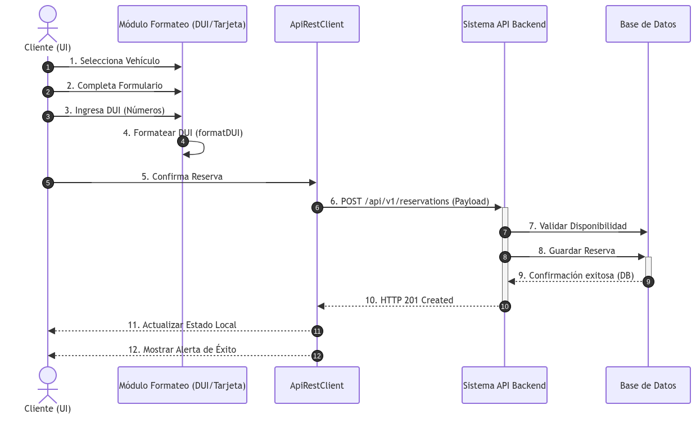

# Diagrama de Secuencia - Flujo Principal de Reserva

## 1. Diagrama de Interacción

> **Nota:** La representación gráfica del diagrama se encuentra almacenada en `docs/assets/diagrama_secuencia.png`.

---

## 2. Explicación del Flujo de Interacción

El diagrama modela los pasos secuenciales que ocurren desde que el usuario completa el formulario de reserva hasta que la app confirma la transacción:

1. **Interacción Inicial (UI):**
   * El usuario selecciona un vehículo del catálogo (`CatalogScreen`) y presiona el botón **"Solicitar Reserva"**.
   * La app redirige a la vista de formulario (`ReservationScreen`), precargando la información básica del usuario en sesión.

2. **Ingreso y Formateo de Datos:**
   * El usuario ingresa su Documento Único de Identidad (DUI).
   * El controlador aplica la función de autoformato en tiempo real (`formatDUI`), insertando el guion automáticamente (`00000000-0`).
   * El usuario selecciona el método de pago (Tarjeta, Transferencia o Aeropuerto) y presiona **"Confirmar y Procesar Alquiler"**.

3. **Validación en Cliente (Client-Side Validation):**
   * El componente verifica la validez del correo electrónico mediante expresión regular (`validateEmail`).
   * Se comprueba la longitud exacta del DUI (10 caracteres) y la presencia de los datos de pago si eligió opción con tarjeta.

4. **Petición al Servidor (API REST Request):**
   * La aplicación genera una petición HTTP con método `POST` hacia la ruta `/api/v1/reservations`.
   * El cuerpo de la solicitud (*Payload*) incluye los datos del cliente, el vehículo seleccionado, la fecha y el método de pago en formato JSON.

5. **Procesamiento Backend y Base de Datos:**
   * La API REST procesa la solicitud, valida la disponibilidad del vehículo en la base de datos y registra la nueva reserva con un identificador único.
   * El servidor devuelve un código de estado `201 Created` junto con el objeto de respuesta codificado en JSON.

6. **Actualización de Estado Local (React Hooks):**
   * El estado global de reservas (`userReservations`) se actualiza mediante `setUserReservations` agregando la nueva reserva al inicio del arreglo.
   * La app despliega una alerta nativa de confirmación (`Alert.alert`) y navega al usuario hacia el panel de **"Mis Reservas Activas"**.
